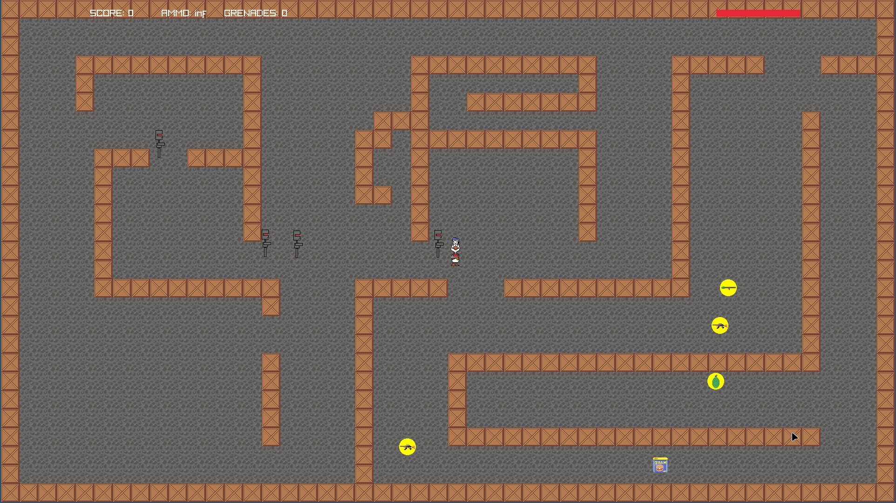
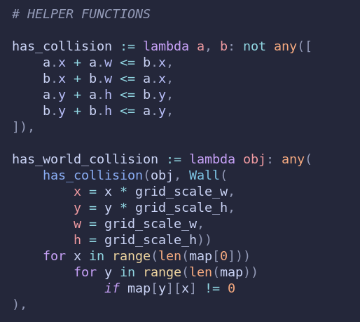
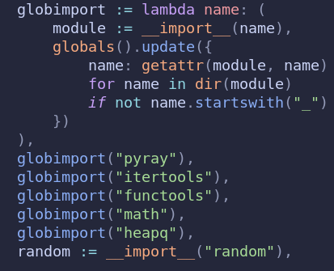
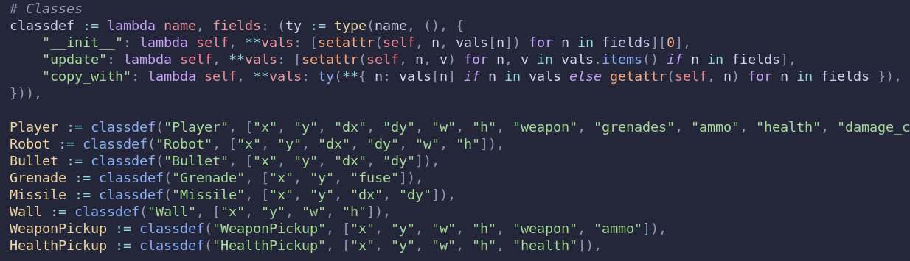
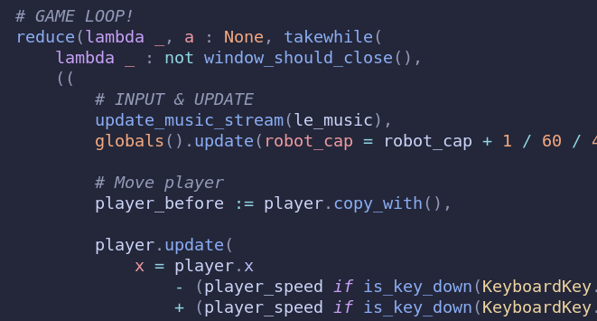
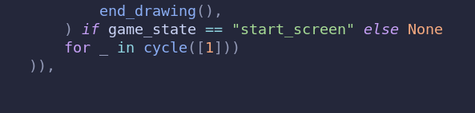

# GameJamWinter2025

A simple top-down shooter about surviving hoards of robots as long as possible
while eating Spam™, **implemented as a single Python expression**. It was
created by Astrid Lauenstein(https://github.com/AcqRel) & Morgan Nordberg
during the GameJam hosted by LiTHe Kod(https://lithekod.se/) january 2025.

# Features
The game itself is a very simple top down shooter
- Multiple weapons
- Explosives
- Start- & Gameover screens
- Simple path finding
- Sound effects & Music

# Technical details/nonsense
A brief overview of how we solved some common trivialities, but with the added
difficulty of the self imposed challange of coding the entire game using only
a single Python expression. Specifically the whole game itself is the side
effect of evaluating a tuple.

## Assigment
This is simply achieved by using the := (walrus) operator, which allows us to
do assignment as an expression

## Defining functions
Since we can do assignment using the walrus, we can assign lambdas and use
these as helper functions

## Importing modules
We can then define a function for importing modules since this isn't entirely straight forward

## Creating classes
funnily enough, the type() funution isn't just capable of checking the type of
an object. It can also create new types during runtime. So we can create
classes dynamically. This is again not very straight forward so we have a neat
function for that. A class factory of sorts. The OOP crowd would surely be
proud

## Achieving a game loop
To achieve a game loop we need an infinite iterator, whose values we'll take
from as long as some given condition holds. We achieve this with the take_while
iterator, and cycle from itertools. We additionally have a reduce() in order to
make sure we discard whatever garbage data we end up evaluating as to not leak
memory. And the entire game loop is the side effects of evaluating the data
from the iterator.

Simply put all the actual game logic between these two parts:

